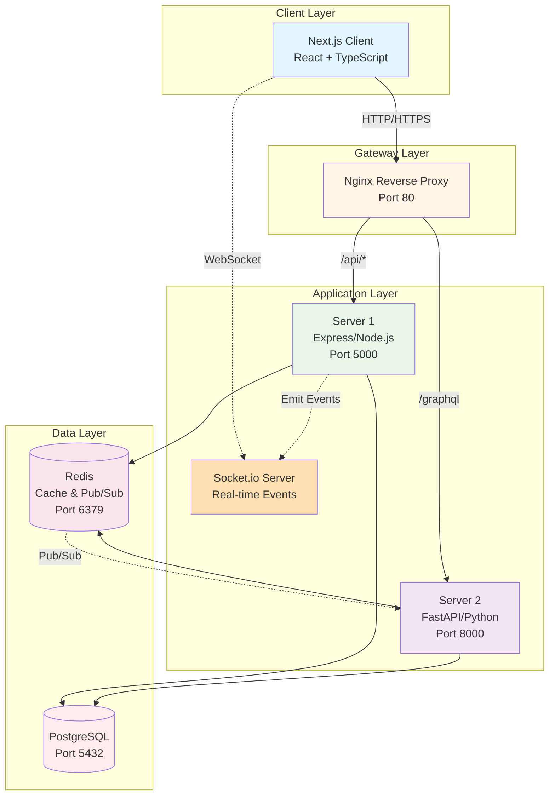
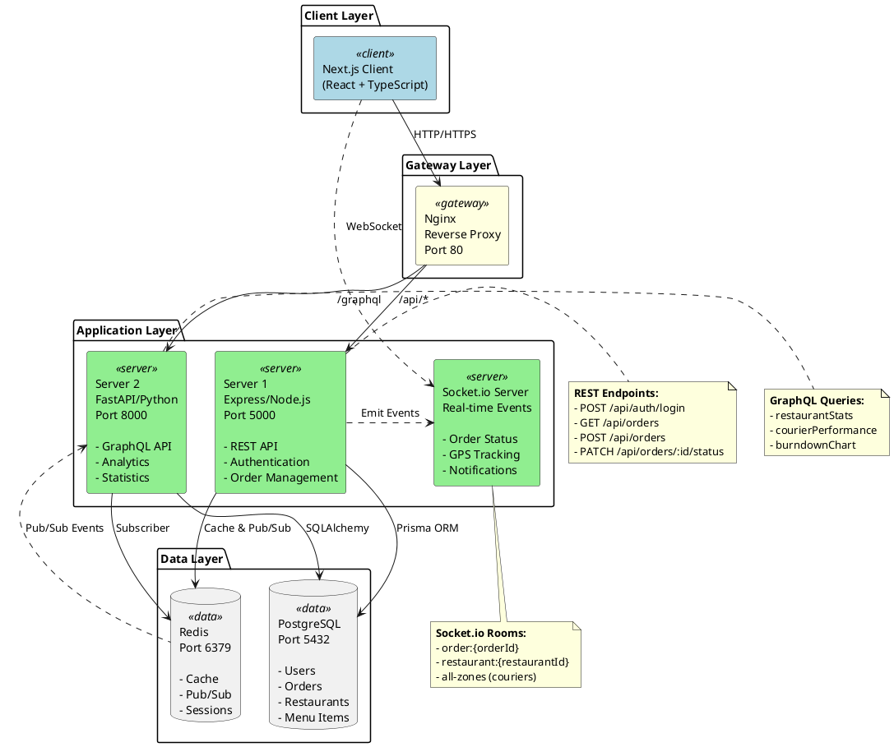
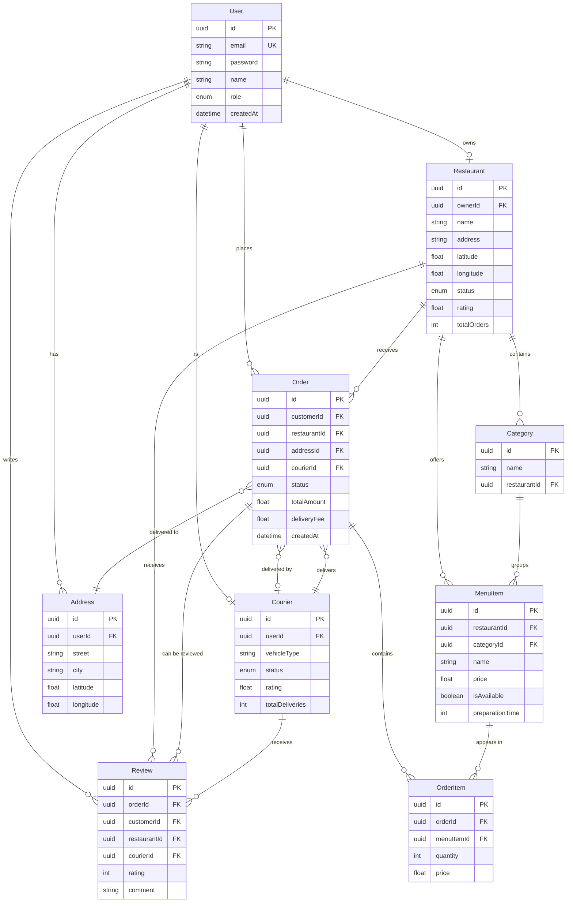
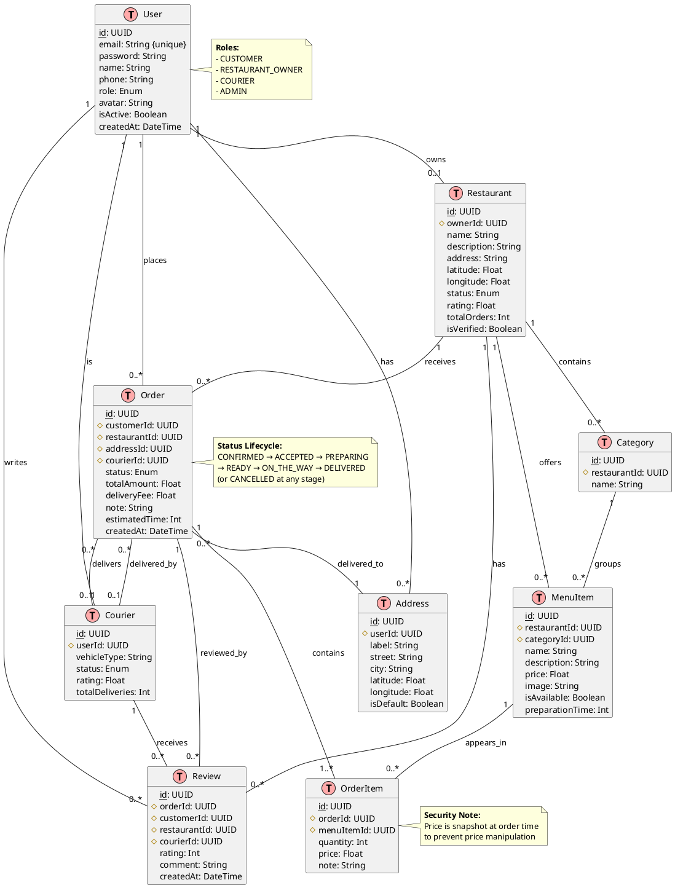
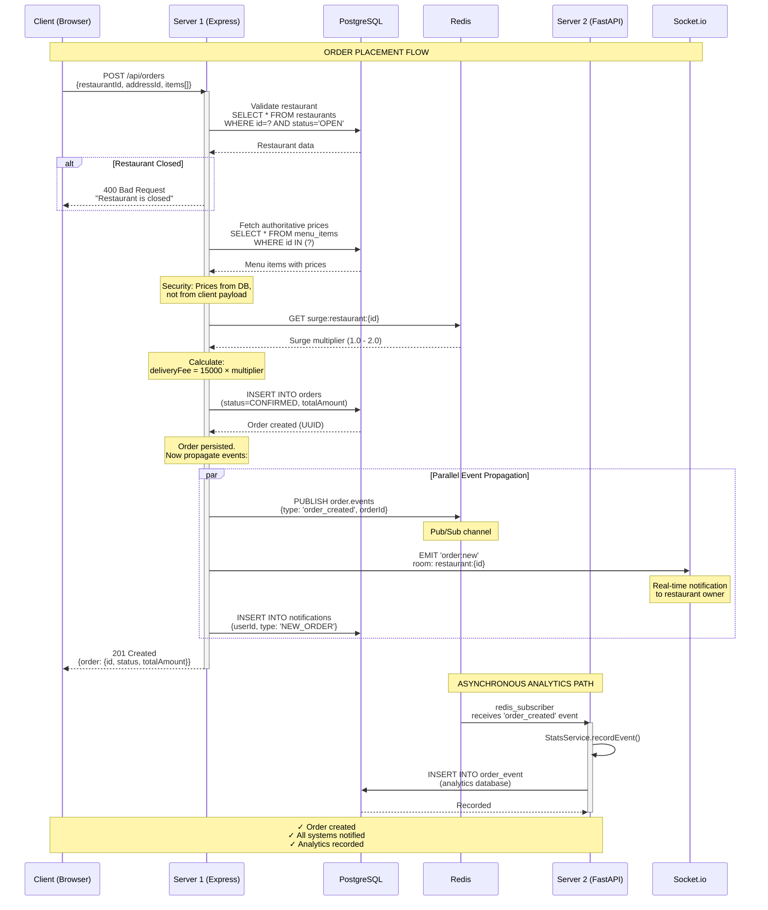
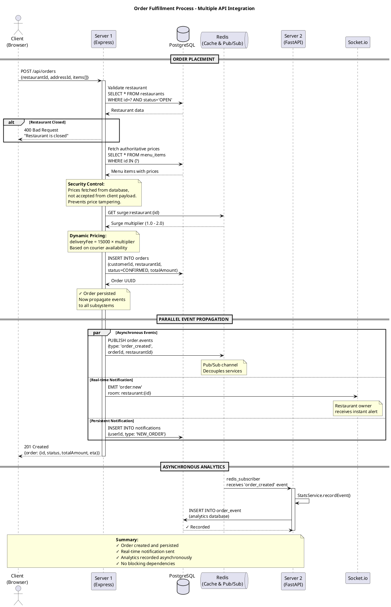
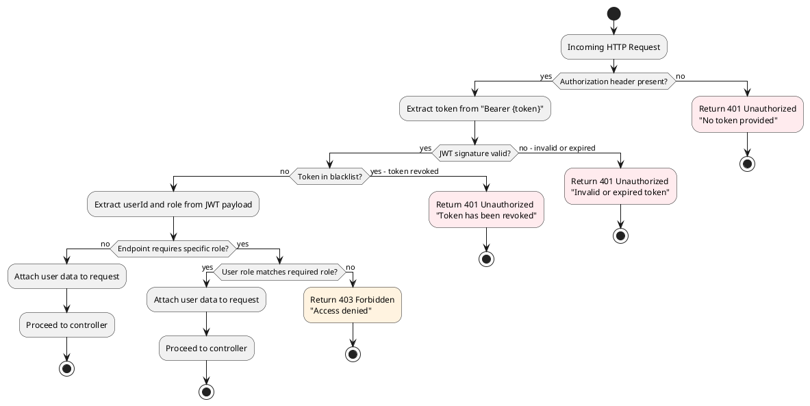
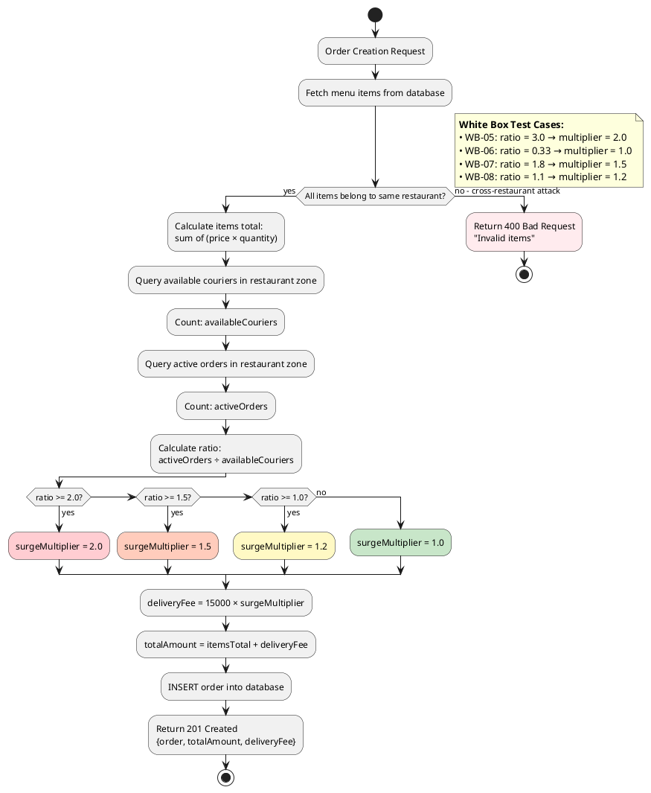

# Assignment Diagrams - Copy & Paste Ready

**Instructions**: Copy the code blocks below and paste them into diagram rendering tools.
- **Mermaid**: https://mermaid.live or GitHub/VS Code
- **PlantUML**: http://www.plantuml.com/plantuml or IntelliJ IDEA

---

# Figure 1: DeliverEat Microservices Architecture

**Location in Assignment**: Section 3.2 - Design and Justification of the DeliverEat API Architecture (M2, D2)

**How to Reference in Text**:
```
As illustrated in Figure 1, the system utilizes Nginx as a reverse proxy gateway 
to efficiently route incoming traffic between Server 1 (REST/Socket.io) and Server 2 
(FastAPI/GraphQL). This design is justified by the "Separation of Concerns" principle; 
by isolating the real-time operational logic from the computationally heavy analytics 
engine, the platform ensures that a surge in analytical queries does not degrade the 
performance of live order tracking.
```

## Mermaid Code - Architecture Diagram



## PlantUML Code - Architecture Diagram



---

# Figure 2: Database Schema for DeliverEat

**Location in Assignment**: Section 3.3 - Data Modeling and API Interaction (LO2)

**How to Reference in Text**:
```
Figure 2 presents the Entity Relationship Diagram (ERD) for the DeliverEat ecosystem. 
The APIs interact with these entities—such as Users, Restaurants, MenuItems, and Orders—
using Object-Relational Mapping (ORM) tools like Prisma and SQLAlchemy. This schema 
ensures that the REST API can perform efficient CRUD operations on the operational tables, 
whilst the GraphQL API can execute complex join queries for analytics without data redundancy.
```

## Mermaid Code - Entity Relationship Diagram



## PlantUML Code - Entity Relationship Diagram



---

# Figure 3: Sequence Diagram - Order Fulfillment Process

**Location in Assignment**: Section 4.1 - Implementation of the Multi-API Solution (P3, M3, D3)

**How to Reference in Text**:
```
The implementation phase focused on orchestrating multiple APIs to work in harmony during 
a single business transaction. The complexity of this interaction is best demonstrated 
during the order fulfillment lifecycle.

As shown in the Sequence Diagram (Figure 3), a single order placement triggers a chain 
of API events:

1. The Client sends a REST POST request to Server 1.
2. Server 1 validates the request and publishes an event to the Redis Pub/Sub channel.
3. Simultaneously, Server 1 emits a WebSocket event via Socket.io to notify the restaurant 
   in real-time.
4. Server 2, acting as a subscriber, consumes the Redis event to update the GraphQL-based 
   analytics database.

This multi-API construction (D3) ensures that the system remains responsive and that data 
is synchronized across different services using the most appropriate protocol for each task.
```

## Mermaid Code - Sequence Diagram



## PlantUML Code - Sequence Diagram



---

# Figure 4: Flowchart - Authentication Logic (White Box Testing)

**Location in Assignment**: Section 5.1 - White Box Testing and Structural Analysis (P4)

**How to Reference in Text**:
```
White box testing was conducted to verify the internal logic and conditional branches 
of the source code. This ensures that all "code paths" are functioning as intended, 
particularly for security-critical functions like authentication and price calculation.

Figure 4 illustrates the internal logic flow for the authentication middleware. By mapping 
out the decision nodes (e.g., Is the authorization header present? Is the JWT signature valid? 
Is the token blacklisted? Does the user role match the required role?), I was able to design 
test cases that exercise every possible branch. The results of the structural testing confirmed 
that the application correctly handles edge cases, such as rejecting expired tokens and 
preventing unauthorized access through role-based access control (RBAC).
```

## Mermaid Code - Authentication Flowchart

```mermaid
flowchart TD
    Start([Incoming HTTP Request]) --> CheckHeader{Authorization<br/>header present?}
    
    CheckHeader -->|No| Err401A[Return 401<br/>"No token provided"]
    CheckHeader -->|Yes| ExtractToken[Extract token from<br/>'Bearer {token}']
    
    ExtractToken --> VerifyJWT{JWT signature<br/>valid?}
    
    VerifyJWT -->|Invalid/Expired| Err401B[Return 401<br/>"Invalid token"]
    VerifyJWT -->|Valid| CheckBlacklist{Token in<br/>blacklist?}
    
    CheckBlacklist -->|Yes| Err401C[Return 401<br/>"Token revoked"]
    CheckBlacklist -->|No| ExtractUser[Extract userId and role<br/>from JWT payload]
    
    ExtractUser --> CheckRole{Endpoint requires<br/>specific role?}
    
    CheckRole -->|No role check| Success[Attach user data to request<br/>Proceed to controller]
    CheckRole -->|Yes| RoleMatch{User role matches<br/>required role?}
    
    RoleMatch -->|No| Err403[Return 403<br/>"Access denied"]
    RoleMatch -->|Yes| Success
    
    Success --> End([Controller Execution])
    Err401A --> End
    Err401B --> End
    Err401C --> End
    Err403 --> End
    
    style Start fill:#e1f5ff
    style End fill:#e8f5e9
    style Err401A fill:#ffebee
    style Err401B fill:#ffebee
    style Err401C fill:#ffebee
    style Err403 fill:#fff3e0
    style Success fill:#e8f5e9
```

## PlantUML Code - Authentication Flowchart



---

# Figure 5: Flowchart - Price Calculation Logic (White Box Testing)

**Location in Assignment**: Section 5.1 - White Box Testing and Structural Analysis (P4)

**How to Reference in Text**:
```
Figure 5 illustrates the internal logic flow for the createOrder controller, specifically 
the price calculation and validation process. By mapping out the decision nodes (e.g., 
Is the restaurant open? Are items available? What is the courier-to-order ratio for surge 
pricing?), I was able to design test cases that exercise every possible branch.

The results of the structural testing confirmed that the application correctly handles edge 
cases, such as rejecting orders from closed restaurants or preventing unauthorized price 
tampering by fetching authoritative data directly from the PostgreSQL database rather than 
accepting client-supplied prices. The surge pricing algorithm was tested across all four 
conditional branches (ratio >= 2.0, >= 1.5, >= 1.0, and < 1.0) to ensure correct multiplier 
application in varying demand scenarios.
```

## Mermaid Code - Price Calculation Flowchart

```mermaid
flowchart TD
    Start([Order Creation Request]) --> FetchItems[Fetch menu items<br/>from database]
    
    FetchItems --> ValidateItems{All items<br/>belong to same<br/>restaurant?}
    
    ValidateItems -->|No| ErrCrossRestaurant[Return 400<br/>"Invalid items"]
    ValidateItems -->|Yes| CalcItemsTotal[Calculate items total:<br/>sum of (price × quantity)]
    
    CalcItemsTotal --> GetCouriers[Query available couriers<br/>in restaurant zone]
    
    GetCouriers --> CountCouriers[Count: availableCouriers]
    
    CountCouriers --> GetOrders[Query active orders<br/>in restaurant zone]
    
    GetOrders --> CountOrders[Count: activeOrders]
    
    CountOrders --> CalcRatio[Calculate ratio:<br/>activeOrders / availableCouriers]
    
    CalcRatio --> CheckRatio{ratio >= 2.0?}
    
    CheckRatio -->|Yes| SetMultiplier20[surgeMultiplier = 2.0]
    CheckRatio -->|No| CheckRatio15{ratio >= 1.5?}
    
    CheckRatio15 -->|Yes| SetMultiplier15[surgeMultiplier = 1.5]
    CheckRatio15 -->|No| CheckRatio10{ratio >= 1.0?}
    
    CheckRatio10 -->|Yes| SetMultiplier12[surgeMultiplier = 1.2]
    CheckRatio10 -->|No| SetMultiplier10[surgeMultiplier = 1.0]
    
    SetMultiplier20 --> CalcDelivery[deliveryFee = 15000 × surgeMultiplier]
    SetMultiplier15 --> CalcDelivery
    SetMultiplier12 --> CalcDelivery
    SetMultiplier10 --> CalcDelivery
    
    CalcDelivery --> CalcTotal[totalAmount = itemsTotal + deliveryFee]
    
    CalcTotal --> CreateOrder[INSERT order into database]
    
    CreateOrder --> ReturnOrder[Return 201 Created<br/>{order, totalAmount, deliveryFee}]
    
    ReturnOrder --> End([End])
    ErrCrossRestaurant --> End
    
    style Start fill:#e1f5ff
    style End fill:#e8f5e9
    style ErrCrossRestaurant fill:#ffebee
    style SetMultiplier20 fill:#ffcdd2
    style SetMultiplier15 fill:#ffccbc
    style SetMultiplier12 fill:#fff9c4
    style SetMultiplier10 fill:#c8e6c9
```

## PlantUML Code - Price Calculation Flowchart



---

# Summary: Diagram Placement Guide for BTEC Unit 37 Assignment

## Figure 1: DeliverEat Microservices Architecture
- **Section**: 3.2 - Design and Justification (M2, D2)
- **Purpose**: Demonstrates high-level architectural design and separation of concerns
- **Key Point**: Proves design skills and justifies technology choices

## Figure 2: Database Schema for DeliverEat
- **Section**: 3.3 - Data Modeling and API Interaction (LO2)
- **Purpose**: Shows the data foundation supporting all API operations
- **Key Point**: Illustrates how REST and GraphQL APIs interact with relational data

## Figure 3: Sequence Diagram - Order Fulfillment Process
- **Section**: 4.1 - Implementation of Multi-API Solution (P3, M3, D3)
- **Purpose**: **GOLDEN EVIDENCE for Distinction D3** - demonstrates multiple APIs working together
- **Key Point**: Shows REST, Redis Pub/Sub, Socket.io, and GraphQL coordinating in a single transaction

## Figure 4: Authentication Logic Flowchart
- **Section**: 5.1 - White Box Testing (P4)
- **Purpose**: Proves understanding of internal code structure and conditional branches
- **Key Point**: Shows all decision paths in authentication middleware

## Figure 5: Price Calculation Logic Flowchart
- **Section**: 5.1 - White Box Testing (P4)
- **Purpose**: Demonstrates structural testing of business logic
- **Key Point**: Shows surge pricing algorithm with all four conditional branches tested

---

# How to Use These Diagrams in Your Assignment

## Step 1: Render the Diagrams
1. Copy the Mermaid or PlantUML code for each figure
2. Paste into https://mermaid.live or http://www.plantuml.com/plantuml
3. Export as PNG or SVG (300 DPI recommended for printing)

## Step 2: Insert into Word Document
1. Place cursor at the insertion point (e.g., after "As illustrated in Figure 1...")
2. Insert → Picture → select your exported PNG/SVG
3. Right-click image → Insert Caption
4. Caption text: "Figure 1: DeliverEat Microservices Architecture"
5. Centre-align the image

## Step 3: Reference in Text
Use the provided "How to Reference in Text" examples above. Always:
- Introduce the figure before showing it
- Explain what the figure demonstrates
- Link it back to the grading criteria (P3, M2, D3, etc.)

## Step 4: List of Figures (Optional but Recommended)
Add a "List of Figures" page after your Table of Contents:
```
List of Figures

Figure 1: DeliverEat Microservices Architecture ............................ 12
Figure 2: Database Schema for DeliverEat .................................. 15
Figure 3: Sequence Diagram of the Order Fulfillment Process ............... 18
Figure 4: Flowchart of Authentication Middleware Logic .................... 24
Figure 5: Flowchart of Price Calculation with Surge Pricing ............... 25
```

---

# Professional Writing Tips for Figure References

## Good Examples:

✅ "As illustrated in Figure 1, the system architecture..."
✅ "Figure 2 demonstrates the entity relationships..."
✅ "The sequence diagram (Figure 3) shows how multiple APIs coordinate..."
✅ "By examining the flowchart in Figure 4, we can identify five distinct code paths..."

## Avoid:

❌ "Here is a picture of the architecture"
❌ "See below for diagram"
❌ "Figure 1 (above/below)"

## UK Academic Style:

- Use "whilst" not "while" in formal writing
- Use "utilises" not "uses" for technical descriptions
- Use "demonstrates" not "shows"
- Use "illustrates" not "pictures"

---

**✅ All diagrams are now ready with proper academic English references!**

