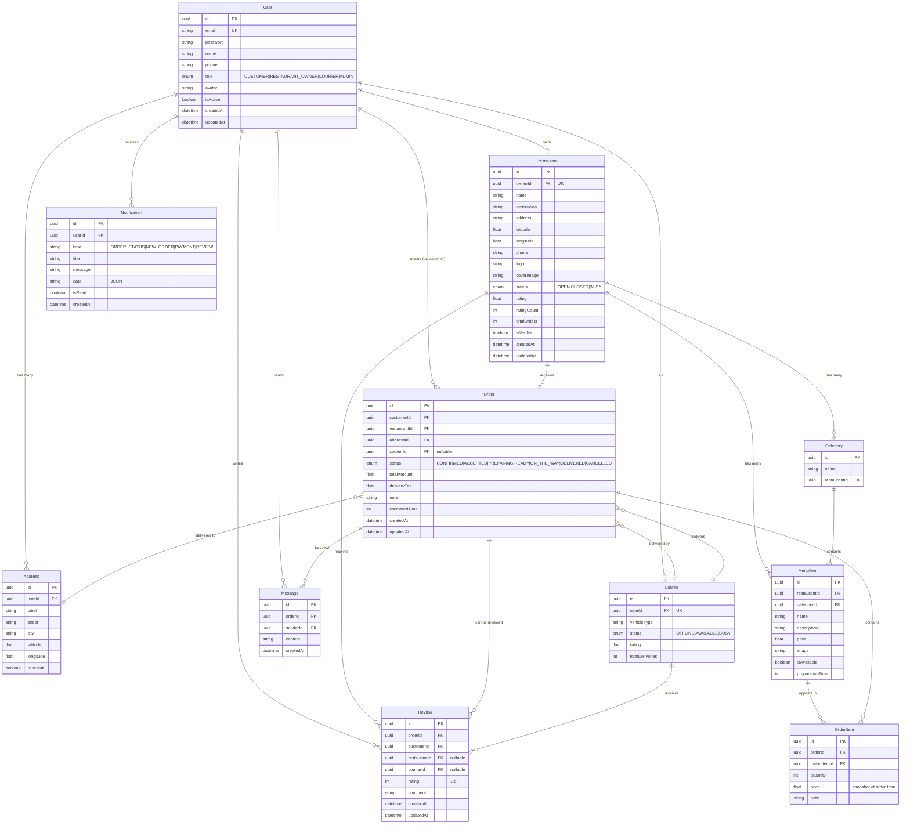
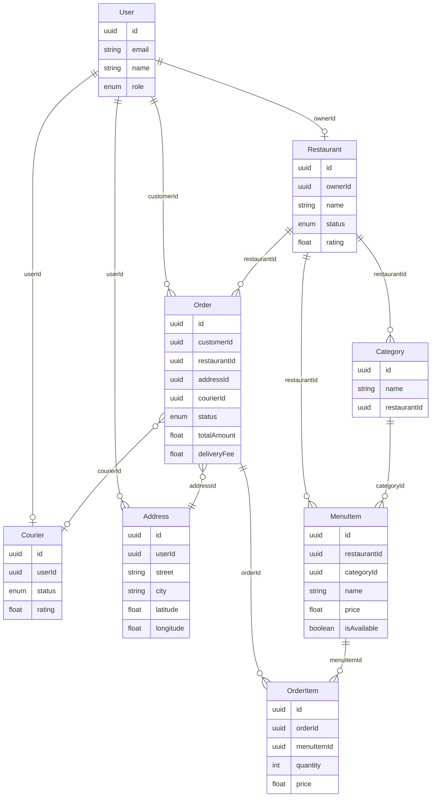
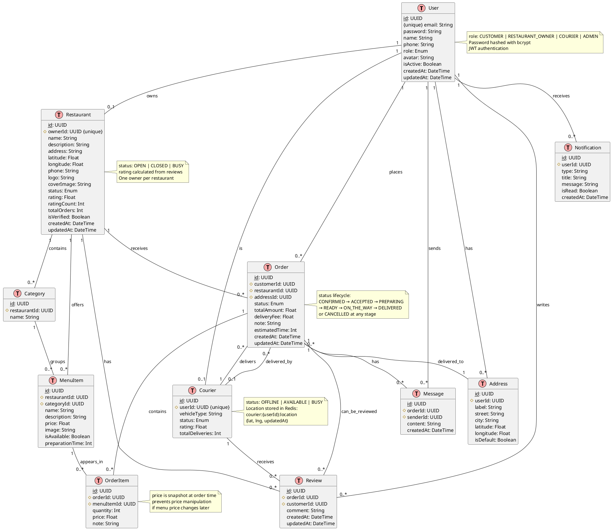

# Database Schema Diagram - DeliverEat

## Entity Relationship Diagram (ERD)

### Mermaid Versiyasi



### Mermaid Versiyasi 2 (Soddalashtirilgan - Asosiy Jadvallargina)



## PlantUML Versiyasi (Class Diagram Format)



## Jadvallar Tavsifi

### 👤 User (Foydalanuvchilar)
**Maqsad**: Barcha tizim foydalanuvchilarini saqlash (mijoz, restoran egasi, kuryer, admin)

| Ustun | Tur | Tavsif |
|-------|-----|--------|
| id | UUID | Primary Key |
| email | String | Unique, kirish uchun |
| password | String | bcrypt bilan hashlangan |
| name | String | To'liq ism |
| phone | String | Telefon raqam (nullable) |
| role | Enum | CUSTOMER, RESTAURANT_OWNER, COURIER, ADMIN |
| avatar | String | Profil rasmi URL (nullable) |
| isActive | Boolean | Akkount faol/o'chirilgan |
| createdAt | DateTime | Yaratilgan vaqt |
| updatedAt | DateTime | Oxirgi o'zgarish |

**Relationships**:
- `1:N` → Address (bir foydalanuvchi ko'p manzilga ega)
- `1:N` → Order (bir mijoz ko'p buyurtma beradi)
- `1:1` → Restaurant (restoran egasi faqat bitta restoran ochadi)
- `1:1` → Courier (kuryer profili)
- `1:N` → Message, Review, Notification

---

### 🏪 Restaurant (Restoranlar)
**Maqsad**: Restoran ma'lumotlari va joylashuvi

| Ustun | Tur | Tavsif |
|-------|-----|--------|
| id | UUID | Primary Key |
| ownerId | UUID | Foreign Key → User (Unique) |
| name | String | Restoran nomi |
| description | String | Tavsif (nullable) |
| address | String | Manzil matni |
| latitude | Float | GPS kenglik |
| longitude | Float | GPS uzunlik |
| phone | String | Aloqa raqami |
| logo | String | Logo URL (nullable) |
| coverImage | String | Bosh rasm URL (nullable) |
| status | Enum | OPEN, CLOSED, BUSY |
| rating | Float | O'rtacha baho (0-5) |
| ratingCount | Int | Nechta baholangan |
| totalOrders | Int | Jami buyurtmalar soni |
| isVerified | Boolean | Tasdiqlangan restoran |

**Relationships**:
- `N:1` → User (ownerId)
- `1:N` → Category
- `1:N` → MenuItem
- `1:N` → Order
- `1:N` → Review

---

### 🍕 MenuItem (Menu Mahsulotlari)
**Maqsad**: Restoran menyu itemlari

| Ustun | Tur | Tavsif |
|-------|-----|--------|
| id | UUID | Primary Key |
| restaurantId | UUID | Foreign Key → Restaurant |
| categoryId | UUID | Foreign Key → Category (nullable) |
| name | String | Mahsulot nomi |
| description | String | Tavsif (nullable) |
| price | Float | Narx (so'm) |
| image | String | Rasm URL (nullable) |
| isAvailable | Boolean | Mavjud/tugagan |
| preparationTime | Int | Tayyorlash vaqti (daqiqa) |

**Relationships**:
- `N:1` → Restaurant
- `N:1` → Category
- `1:N` → OrderItem

---

### 📦 Order (Buyurtmalar)
**Maqsad**: Mijoz buyurtmalari

| Ustun | Tur | Tavsif |
|-------|-----|--------|
| id | UUID | Primary Key |
| customerId | UUID | Foreign Key → User |
| restaurantId | UUID | Foreign Key → Restaurant |
| addressId | UUID | Foreign Key → Address |
| courierId | UUID | Foreign Key → Courier (nullable) |
| status | Enum | CONFIRMED, ACCEPTED, PREPARING, READY, ON_THE_WAY, DELIVERED, CANCELLED |
| totalAmount | Float | Jami summa |
| deliveryFee | Float | Yetkazish narxi |
| note | String | Izoh (nullable) |
| estimatedTime | Int | Taxminiy vaqt (daqiqa) |

**Relationships**:
- `N:1` → User (customer)
- `N:1` → Restaurant
- `N:1` → Address
- `N:1` → Courier (nullable)
- `1:N` → OrderItem
- `1:N` → Message
- `1:N` → Review

**Status Lifecycle**:
```
CONFIRMED → ACCEPTED → PREPARING → READY → ON_THE_WAY → DELIVERED
     ↓           ↓           ↓          ↓         ↓
                      CANCELLED (istalgan bosqichda)
```

---

### 🛒 OrderItem (Buyurtma Itemlari)
**Maqsad**: Har bir buyurtmadagi mahsulotlar ro'yxati

| Ustun | Tur | Tavsif |
|-------|-----|--------|
| id | UUID | Primary Key |
| orderId | UUID | Foreign Key → Order |
| menuItemId | UUID | Foreign Key → MenuItem |
| quantity | Int | Miqdori |
| price | Float | **Buyurtma vaqtidagi narx** (snapshot) |
| note | String | Maxsus talab (nullable) |

**⚠️ Muhim**: `price` ustuni menu itemning buyurtma berilgan paytdagi narxini saqlaydi. Agar keyinroq menu narxi o'zgarse, mavjud buyurtmalar ta'sir qilmaydi (price tampering himoyasi).

**Relationships**:
- `N:1` → Order
- `N:1` → MenuItem

---

### 🚴 Courier (Kurierlar)
**Maqsad**: Kuryer profili va statistikasi

| Ustun | Tur | Tavsif |
|-------|-----|--------|
| id | UUID | Primary Key |
| userId | UUID | Foreign Key → User (Unique) |
| vehicleType | String | Transport turi (bike, car, motorcycle) |
| status | Enum | OFFLINE, AVAILABLE, BUSY |
| rating | Float | O'rtacha baho (0-5) |
| totalDeliveries | Int | Jami yetkazilgan buyurtmalar |

**GPS Joylashuv**: Redis da saqlanadi
```
Key: courier:{userId}:location
Value: {lat: 41.2995, lng: 69.2401, updatedAt: 1234567890}
TTL: 300 sekund (5 daqiqa)
```

**Relationships**:
- `1:1` → User
- `1:N` → Order
- `1:N` → Review

---

### 📍 Address (Manzillar)
**Maqsad**: Foydalanuvchi manzillari

| Ustun | Tur | Tavsif |
|-------|-----|--------|
| id | UUID | Primary Key |
| userId | UUID | Foreign Key → User |
| label | String | "Uy", "Ish", "Ota-ona" |
| street | String | Ko'cha, bino raqami |
| city | String | Shahar |
| latitude | Float | GPS kenglik |
| longitude | Float | GPS uzunlik |
| isDefault | Boolean | Default manzil |

**Relationships**:
- `N:1` → User
- `1:N` → Order

---

### 📂 Category (Kategoriyalar)
**Maqsad**: Restoran menu kategoriyalari

| Ustun | Tur | Tavsif |
|-------|-----|--------|
| id | UUID | Primary Key |
| restaurantId | UUID | Foreign Key → Restaurant |
| name | String | "Ichimliklar", "Salatlar", "Asosiy taomlar" |

**Relationships**:
- `N:1` → Restaurant
- `1:N` → MenuItem

---

### 💬 Message (Xabarlar)
**Maqsad**: Buyurtma bo'yicha chat (mijoz ↔ restoran/kuryer)

| Ustun | Tur | Tavsif |
|-------|-----|--------|
| id | UUID | Primary Key |
| orderId | UUID | Foreign Key → Order |
| senderId | UUID | Foreign Key → User |
| content | String | Xabar matni |
| createdAt | DateTime | Yuborilgan vaqt |

**Relationships**:
- `N:1` → Order
- `N:1` → User (sender)

---

### ⭐ Review (Baholar va Sharhlar)
**Maqsad**: Restoran va kuryer baholash

| Ustun | Tur | Tavsif |
|-------|-----|--------|
| id | UUID | Primary Key |
| orderId | UUID | Foreign Key → Order |
| customerId | UUID | Foreign Key → User |
| restaurantId | UUID | Foreign Key → Restaurant (nullable) |
| courierId | UUID | Foreign Key → Courier (nullable) |
| rating | Int | 1-5 yulduz |
| comment | String | Sharh (nullable) |

**Constraints**:
- `UNIQUE(orderId, restaurantId)` - har bir buyurtma uchun faqat 1 restoran bahosi
- `UNIQUE(orderId, courierId)` - har bir buyurtma uchun faqat 1 kuryer bahosi

**Relationships**:
- `N:1` → Order
- `N:1` → User (customer)
- `N:1` → Restaurant (nullable)
- `N:1` → Courier (nullable)

---

### 🔔 Notification (Bildirishnomalar)
**Maqsad**: Push notifications va xabarlar

| Ustun | Tur | Tavsif |
|-------|-----|--------|
| id | UUID | Primary Key |
| userId | UUID | Foreign Key → User |
| type | String | ORDER_STATUS, NEW_ORDER, PAYMENT, REVIEW |
| title | String | Sarlavha |
| message | String | Xabar matni |
| data | String | Qo'shimcha JSON ma'lumot (nullable) |
| isRead | Boolean | O'qilgan/o'qilmagan |
| createdAt | DateTime | Yaratilgan vaqt |

**Relationships**:
- `N:1` → User

---

## Indekslar (Query Optimallashtirish)

```sql
-- Order queries
CREATE INDEX idx_orders_customer ON orders(customerId, createdAt DESC);
CREATE INDEX idx_orders_restaurant ON orders(restaurantId, status);
CREATE INDEX idx_orders_courier ON orders(courierId, status);

-- MenuItem availability
CREATE INDEX idx_menu_items_availability ON menu_items(restaurantId, isAvailable);

-- Notifications unread
CREATE INDEX idx_notifications_unread ON notifications(userId, isRead, createdAt DESC);

-- Messages timeline
CREATE INDEX idx_messages_order ON messages(orderId, createdAt DESC);

-- Reviews lookup
CREATE INDEX idx_reviews_restaurant ON reviews(restaurantId);
CREATE INDEX idx_reviews_courier ON reviews(courierId);
```

---

## Foreign Key Constraints (Ma'lumot Yaxlitligi)

| Child Table | Column | Parent Table | On Delete |
|-------------|--------|--------------|-----------|
| Address | userId | User | CASCADE |
| Restaurant | ownerId | User | - |
| Category | restaurantId | Restaurant | CASCADE |
| MenuItem | restaurantId | Restaurant | CASCADE |
| MenuItem | categoryId | Category | SET NULL |
| Order | customerId | User | - |
| Order | restaurantId | Restaurant | - |
| Order | addressId | Address | - |
| Order | courierId | Courier | SET NULL |
| OrderItem | orderId | Order | CASCADE |
| OrderItem | menuItemId | MenuItem | - |
| Courier | userId | User | - |
| Message | orderId | Order | CASCADE |
| Message | senderId | User | - |
| Review | orderId | Order | CASCADE |
| Review | customerId | User | - |
| Review | restaurantId | Restaurant | SET NULL |
| Review | courierId | Courier | SET NULL |
| Notification | userId | User | CASCADE |

**Cascade Rules**:
- `CASCADE` - Ota qator o'chirilsa, bola qatorlar ham o'chiriladi
- `SET NULL` - Ota qator o'chirilsa, bola qatorning FK si NULL bo'ladi
- `-` (restrict) - Ota qator o'chirilmaydi, agar bola qatorlar mavjud bo'lsa

---

## Query Misollari

### 1. Restoran menu'sini olish (kategoriyalar bilan)
```sql
SELECT 
  c.name as category_name,
  m.name as item_name,
  m.price,
  m.isAvailable
FROM categories c
LEFT JOIN menu_items m ON m.categoryId = c.id
WHERE c.restaurantId = 'uuid-123'
ORDER BY c.name, m.name;
```

### 2. Mijoz buyurtmalarini olish (restaurant va status bilan)
```sql
SELECT 
  o.id,
  o.status,
  o.totalAmount,
  r.name as restaurant_name,
  o.createdAt
FROM orders o
JOIN restaurants r ON r.id = o.restaurantId
WHERE o.customerId = 'uuid-456'
ORDER BY o.createdAt DESC;
```

### 3. Restoran rating'ini yangilash
```sql
UPDATE restaurants
SET 
  rating = (SELECT AVG(rating) FROM reviews WHERE restaurantId = 'uuid-789'),
  ratingCount = (SELECT COUNT(*) FROM reviews WHERE restaurantId = 'uuid-789')
WHERE id = 'uuid-789';
```

### 4. Tayyor buyurtmalarni topish (kuryer uchun, 10km radius)
```sql
SELECT 
  o.id,
  o.totalAmount,
  r.name as restaurant_name,
  r.latitude,
  r.longitude,
  -- Haversine formula - distance hisoblash
  (6371 * acos(
    cos(radians(41.2995)) * cos(radians(r.latitude)) * 
    cos(radians(r.longitude) - radians(69.2401)) + 
    sin(radians(41.2995)) * sin(radians(r.latitude))
  )) as distance_km
FROM orders o
JOIN restaurants r ON r.id = o.restaurantId
WHERE o.status = 'READY'
  AND o.courierId IS NULL
HAVING distance_km <= 10
ORDER BY distance_km ASC;
```

---

## Diagrammani Ko'rish

### Mermaid
1. Kodni `mermaid` blokidan nusxa oling
2. https://mermaid.live ga tashlang
3. Yoki VS Code da Mermaid Preview extension o'rnating

### PlantUML
1. Kodni `plantuml` blokidan nusxa oling
2. http://www.plantuml.com/plantuml ga tashlang
3. PNG/SVG formatda yuklab oling

---

**✅ Database Schema to'liq tayyor!**
