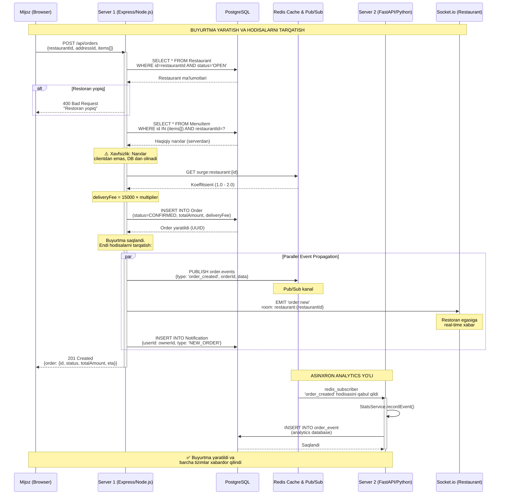
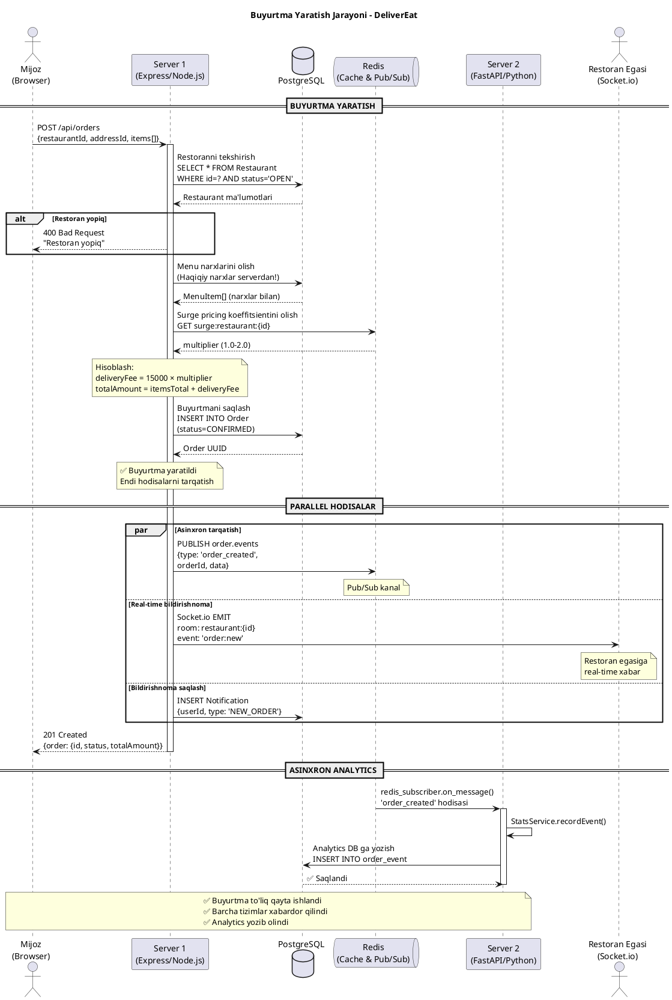

# Sequence Diagram: Buyurtma Yaratish Jarayoni

## Mermaid Diagrammasi (Asosiy versiya)



## PlantUML Versiyasi (Alternativ)



## Batafsil Tushuntirish

### 1️⃣ Buyurtma Yuborish (Client → Server 1)
Mijoz `POST /api/orders` so'rovini yuboradi:
```json
{
  "restaurantId": "uuid-123",
  "addressId": "uuid-456",
  "items": [
    {"menuItemId": "uuid-789", "quantity": 2}
  ]
}
```

### 2️⃣ Restoran va Menu Tekshiruvi (Server 1 → PostgreSQL)
- Restoran `OPEN` statusida ekanligini tekshiradi
- Menu itemlarni va **haqiqiy narxlarni** database dan oladi
- ⚠️ **Xavfsizlik**: Narxlar hech qachon clientdan qabul qilinmaydi (price tampering xujumidan himoya)

### 3️⃣ Surge Pricing (Server 1 → Redis)
- Redis cache dan surge koeffitsientini oladi
- `deliveryFee = 15000 × multiplier` (1.0 - 2.0)
- Agar kurierlar kam bo'lsa, narx oshadi

### 4️⃣ Buyurtmani Saqlash (Server 1 → PostgreSQL)
```sql
INSERT INTO Order (
  customerId, restaurantId, addressId, 
  status, totalAmount, deliveryFee
) VALUES (?, ?, ?, 'CONFIRMED', ?, ?);
```

### 5️⃣ Parallel Hodisalar (3 ta bir vaqtda)

#### A. Redis Pub/Sub - Asinxron
```javascript
await redisService.publish('order.events', {
  type: 'order_created',
  orderId: order.id,
  restaurantId,
  totalAmount
});
```
→ Server 2 bu hodisani eshitadi va analytics DB ga yozadi

#### B. Socket.io - Real-time
```javascript
getIO().to(`restaurant:${restaurantId}`).emit('order:new', {
  orderId: order.id,
  customerName,
  totalAmount
});
```
→ Restoran egasining sahifasida darhol yangi buyurtma paydo bo'ladi

#### C. Notification - Database
```javascript
await prisma.notification.create({
  data: {
    userId: restaurant.ownerId,
    type: 'NEW_ORDER',
    orderId: order.id
  }
});
```
→ Restoran egasi keyinroq bildirishnomalar ro'yxatida ko'radi

### 6️⃣ Server 2 - Analytics (Asinxron)
Server 2 ning `redis_subscriber` bu hodisani qabul qiladi:
```python
async def on_message(message):
    data = json.loads(message['data'])
    if data['type'] == 'order_created':
        await stats_service.recordEvent(
            event_type='order_created',
            order_id=data['orderId'],
            restaurant_id=data['restaurantId']
        )
```

## Qanday Foydalanish

### Mermaid (Tavsiya etiladi)
1. Kodni `mermaid` blokidan ko'chirib oling
2. Quyidagi joylarga qo'ying:
   - **Mermaid Live Editor**: https://mermaid.live
   - **GitHub/GitLab** - markdown faylda avtomatik render qiladi
   - **VS Code** - Mermaid Preview extension o'rnating
   - **Notion, Obsidian** - mermaid bloklarini qo'llab-quvvatlaydi

### PlantUML
1. Kodni `plantuml` blokidan ko'chirib oling
2. Quyidagi joylarga qo'ying:
   - **PlantUML Online**: http://www.plantuml.com/plantuml
   - **IntelliJ IDEA** - PlantUML plugin
   - PNG/SVG sifatida export qiling

## Asosiy Afzalliklar

| Xususiyat | Tushuntirish |
|-----------|--------------|
| **Asinxron Analytics** | Server 2 sekin ishlasa ham, Server 1 bloklanmaydi |
| **Real-time Notification** | Socket.io orqali restoran darhol xabardor bo'ladi |
| **Xavfsizlik** | Narxlar clientdan emas, database dan olinadi |
| **Surge Pricing** | Redis cache orqali tez hisoblash |
| **Parallel Processing** | 3 ta hodisa bir vaqtda bajariladi |
| **Loose Coupling** | Server 1 va Server 2 bir-biriga bog'liq emas (Redis Pub/Sub orqali) |

## Kod Misollari

### Server 1 - Order Controller (order.controller.ts)
```typescript
export const createOrder = async (req: Request, res: Response) => {
  // 1. Restoranni tekshirish
  const restaurant = await prisma.restaurant.findUnique({
    where: { id: restaurantId, status: 'OPEN' }
  });
  
  // 2. Menu narxlarini olish
  const menuItems = await prisma.menuItem.findMany({
    where: { id: { in: menuItemIds }, restaurantId }
  });
  
  // 3. Surge pricing
  const surgeMultiplier = await SurgeService.getSurgeMultiplier(restaurantId);
  const deliveryFee = Math.round(15000 * surgeMultiplier);
  
  // 4. Buyurtmani saqlash
  const order = await prisma.order.create({ data: { ...orderData } });
  
  // 5. Hodisalarni tarqatish (parallel)
  await Promise.all([
    redisService.publish('order.events', { type: 'order_created', orderId: order.id }),
    getIO().to(`restaurant:${restaurantId}`).emit('order:new', { orderId: order.id }),
    prisma.notification.create({ data: { userId: restaurant.ownerId, type: 'NEW_ORDER' } })
  ]);
  
  res.status(201).json({ order });
};
```

### Server 2 - Redis Subscriber (redis_subscriber.py)
```python
async def handle_order_created(data: dict):
    async with AsyncSessionLocal() as db:
        service = StatsService(db)
        await service.recordEvent(
            event_type='order_created',
            order_id=data['orderId'],
            restaurant_id=data['restaurantId'],
            total_amount=data['totalAmount']
        )
        await db.commit()
```

---

**✅ Bu diagram sizning presentatsiya va assignmentingiz uchun tayyor!**
